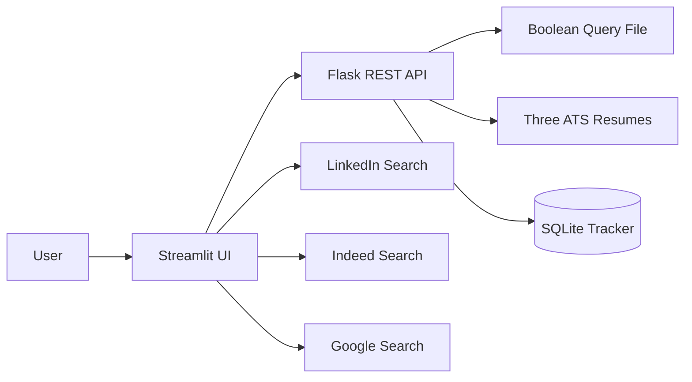

# CareerTwin SearchOps AI

A Streamlit + Flask job-search command center tailored to William Low's three ATS resume tracks:

1. Supply Chain, Forecasting & Operations
2. Applied AI & Machine Learning
3. Healthcare AI & Operations

## What it does

- Reads the supplied Boolean-query file and organizes searches by career track.
- Launches official LinkedIn, Indeed, and Google search pages.
- Rotates daily and secondary searches to reduce overload.
- Analyzes pasted job descriptions using a transparent local rules-and-keyword engine.
- Recommends the most relevant ATS resume.
- Shows matched and missing terms.
- Tracks saved jobs, applications, interviews, notes, and follow-up dates in SQLite.
- Keeps a human in control and does not scrape or auto-apply.

## Suggested product names

- **CareerTwin SearchOps AI** — recommended; links directly to the existing CareerTwin brand.
- **CareerTwin Job Command Center** — clear and recruiter-friendly.
- **RoleRadar AI** — concise and marketable.
- **JobVector AI** — technical and modern.
- **CareerOps AI** — emphasizes workflow and execution.
- **ApplyPilot AI** — approachable, but avoid implying automatic submission.
- **TalentRoute AI** — emphasizes matching and direction.

## Windows quick start

Double-click:

```text
run_app.bat
```

The script creates a virtual environment, installs dependencies, starts Flask, and launches Streamlit.

## Manual start

Terminal 1:

```bash
python -m venv .venv
.venv\Scripts\activate
pip install -r requirements.txt
python backend/app.py
```

Terminal 2:

```bash
.venv\Scripts\activate
streamlit run frontend/streamlit_app.py
```

Open Streamlit at `http://localhost:8501`.

## Architecture



## Safety and platform compliance

The app creates search links and lets the user open official job sites. It intentionally does not scrape LinkedIn or Indeed, automate login, press platform buttons, or submit applications.

## Future enhancements

- Gmail ingestion of official job-alert emails.
- Duplicate-posting detection.
- Optional Gemini/Groq explanation layer.
- Resume bullet suggestions with explicit user approval.
- Cover-letter drafting.
- Dashboard analytics by track, source, response rate, and interview rate.
- CSV import/export.
"# CareerTwin_SearchOps_AI" 
