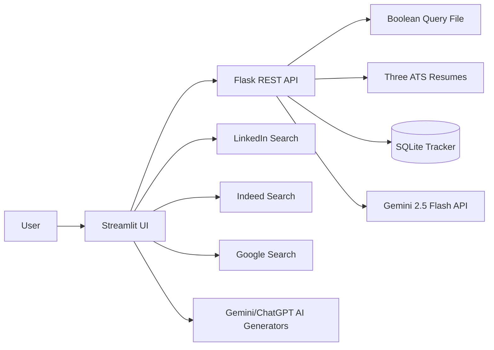

# CareerTwin SearchOps AI

A Streamlit + Flask job-search command center tailored to William Low's three ATS resume tracks:

1. Supply Chain, Forecasting & Operations
2. Applied AI & Machine Learning
3. Healthcare AI & Operations

## What it does

- Reads the supplied Boolean-query file and organizes searches by career track.
- Launches official LinkedIn, Indeed, and Google search pages.
- Rotates daily and secondary searches to reduce overload.
- **LLM Job Analyzer:** Analyzes pasted job descriptions using Gemini 2.5 Flash against your three ATS resumes to calculate a fit score and recommend the best resume.
- **Portfolio Integration:** Automatically scrapes and extracts your live portfolio website straight from your resume to use as context during job grading!
- **AI Prompt Generation:** Instantly builds custom prompts for Gemini or ChatGPT to generate job tables (24 hours, 1 week, 2 weeks) and calculates your chances of success on applications.
- **Seamless AI Handoff:** Copies prompts and seamlessly auto-opens ChatGPT (with the prompt injected automatically into the URL) or Gemini for lightning-fast execution.
- Tracks saved jobs, applications, interviews, notes, and follow-up dates in SQLite.
- Keeps a human in control and does not scrape or auto-apply.

## Deployment (Render & Docker)

This application is fully configured for a **single-container deployment on Render**. 
- Simply create a new **Web Service** on Render, choose **Docker** as the environment, and point it to this repository. 
- The included `Dockerfile` and `render-start.sh` will automatically route the frontend Streamlit UI to the public port while keeping the Flask API secure internally.
- **IMPORTANT**: Make sure to add `GEMINI_API_KEY` to your Render Environment Variables for the Job Analyzer to work.

## Windows Local Quick Start

Double-click:

```text
run_app.bat
```

The script creates a virtual environment, installs dependencies, starts Flask, and launches Streamlit.

## Manual Local Start

Terminal 1 (Backend):

```bash
python -m venv .venv
.venv\Scripts\activate
pip install -r requirements.txt
python backend/app.py
```

Terminal 2 (Frontend):

```bash
.venv\Scripts\activate
streamlit run frontend/streamlit_app.py
```

Open Streamlit at `http://localhost:8501`.

## Architecture



## Safety and platform compliance

The app creates search links and lets the user open official job sites. It intentionally does not scrape LinkedIn or Indeed, automate login, press platform buttons, or submit applications.

## Future enhancements

- Gmail ingestion of official job-alert emails.
- Duplicate-posting detection.
- Resume bullet suggestions with explicit user approval.
- Cover-letter drafting.
- Dashboard analytics by track, source, response rate, and interview rate.
- CSV import/export.
